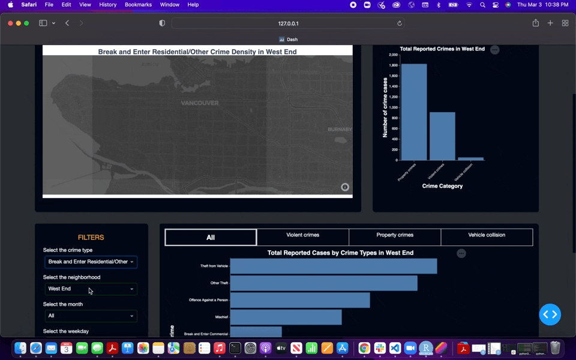

# Welcome to Safe Vancity Dashboard App!

Welcome! 👋 欢迎 🎊 Bienvenue! 🎉 

Thank you for visiting the Safe Vancity app project repository. This is a Vancouver crime incidence app and we are your friendly, neighbourhood data scientists wanting to help you make the safest choice of location for your next forever or rental homes with the creation of this app.
The most recent version of the dashboard is available at the following link: [INSERT LINK]

This app was developed as part of the course requirement for DSCI 532 - Data Visualization II course in the Master of Data Science program at the University of British Columbia, Vancouver, Canada.

In this document we outline some information about the project. See sections below:

## Relevance

Being the largest city in British Columbia, Vancouver is an attractive city to call home for many. Reasons include its vast ethnic diversity, natural landscape, coastal, foresty, job market and so on. Despite the vibrant quality of this city, an important factor when deciding to live in a specific city depends on the safety of its neighborhoods, along with other factors such as access to essential services, cost of living etc. Research evidence have shown that crime types have had significant changes during COVID at neighborhood levels in Vancouver (Anderson and Hodgkinson 2022). For example, assault cases, arson and robbery have increased in Vancouver’s Downtown core, Strathcona and Mount Pleasant areas. At VanRealtor, we wanted to offer our clients the decision to choose their next neighborhood to move, rent or visit while being aware of the crimes statistics of the city. 

## Overview

The Safe Vancity app is an interactive platform that provides an overview of the crime reports across various Vancouver neighburhoods, based on 2021 crime statistics data. This dashboard aims to help people make decisions when considering their next trip or move to Vancouver, BC, via visually exploring a dataset of crime statistics from last year. We are currently only reporting incidence in 2021 for the ease of usage of the app and may incoporate past years data at a later stage. The dashboard also provides summaries of important metrics related to crime statistics and allows useres to filter information by geological location, crime type, crime category (violent vs property crimes),and time of the crime (month, weekday).

## App Description and Implementation

The Safe Vancity app opens to a landing page with three plots. In the bottom left-hand side we have added all the filters in dropdown lists which includes crime types, neighbourhoods, month, and weekday. By selecting a `neighbourhood`, all the plots in the app will display metrics related to that `neighbourhood`.  

- The map-chart allows the user to view crime density by `neighbourhood`, `crime type` and `month`. The users can zoom in or out of the area to see the specific streets or area where the crime was reported.  
- The bottom bar plot shows total reported cases in each neighbourhood by crime category (i.e., `Violent`, `Property` or `All` crimes). Users can hover over the plot and see the actual "counts" of cases reported for each selection. There are tabs implemented to select the choice of crime category.  
- The top-right bar plot allows the user to see the number of crimes reported in a neighbourhood by the `day of the week`. Users can hover over the plot and see the actual "counts" of cases reported for each crime category. 

For example, selecting "West End" on neighbourhood, the dashboard will display crime density in the map plot on the top left of the screen, total reported cases in West End by crime type in the bottom bar plot, and number of crimes by weekday in the top-right bar plot. 

### App Design 
[Add a screenshot of the dashboard]

### Implementation and user guide

[Add GIFS]
1. Usage of crime density map

3. Usage of total reported cases by crime category plot
4. Usage of total reported cases by day of the week plot 

## Support

If you run into troubles, please check the [issues](https://github.com/UBC-MDS/safe_vancity/issues) to see if your problem has already been reported or to open new issues. We are here to help!

## Get Involved

We recognize and welcome all contributors.
### Interested in contributing to our dashboard?
Check out the [contributing guidelines](https://github.com/UBC-MDS/safe_vancity/blob/main/CONTRIBUTING.md). Please note that this project is released with a [Code of Conduct](https://github.com/UBC-MDS/safe_vancity/blob/main/CODE_OF_CONDUCT.md). By contributing to this project, you agree to abide by its terms. 

## Code of Conduct 

In the interest of fostering an open and welcoming environment, we as contributors and maintainers pledge to making participation in our project and our community a harassment-free experience for everyone, regardless of age, body size, disability, ethnicity, gender identity and expression, level of experience, nationality, personal appearance, race, religion, or sexual identity and orientation. Detailed descriptions of these points can be found in the [Code of Conduct](https://github.com/UBC-MDS/safe_vancity/blob/main/CODE_OF_CONDUCT.md). 

# About us

Names and GitHub @usernames of developers listed below:

- Arlin Cherian @arlincherian
- Victor Francis @Vikiano
- Wanying Ye @GloriaWYY

## License

`safe_vancity` was created by Arlin Cherian, Victor Francis and Wanying Ye. It is licensed under the terms of the 

## References
Anderson, M., and T. Hodgkinson. 2022. “Andresen MA, Hodgkinson t. In a World Called Catastrophe: The Impact of COVID-19 on Neighbourhood Level Crime in Vancouver, Canada [Published Online Ahead of Print, 2022 Jan 9]. J Exp Criminol. 2022;1-25. Doi:10.1007/S11292-021-09495-6.” Journal of Experimental Criminology, 1–25.

